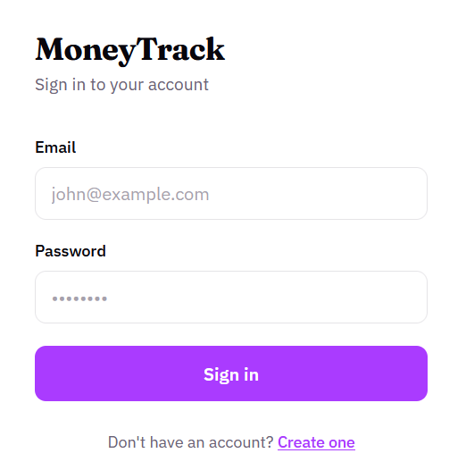
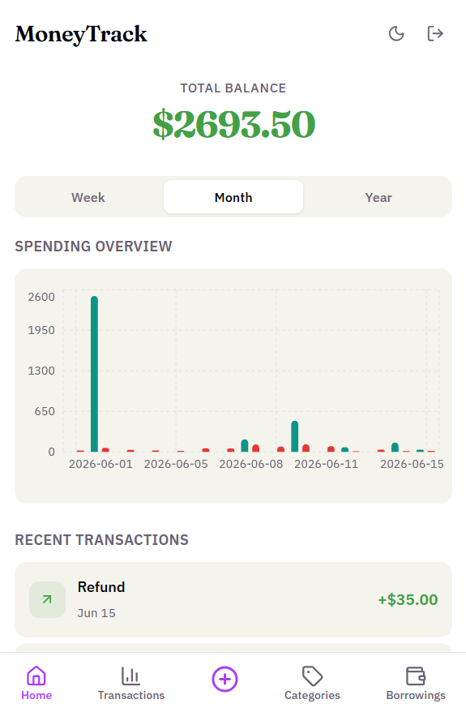
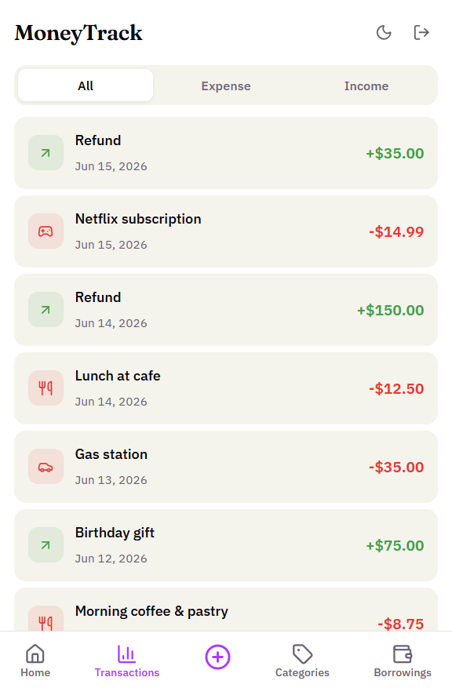
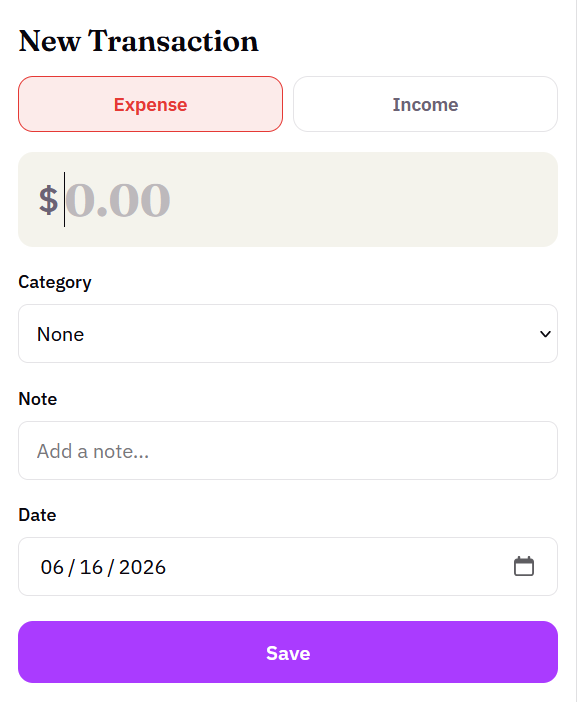
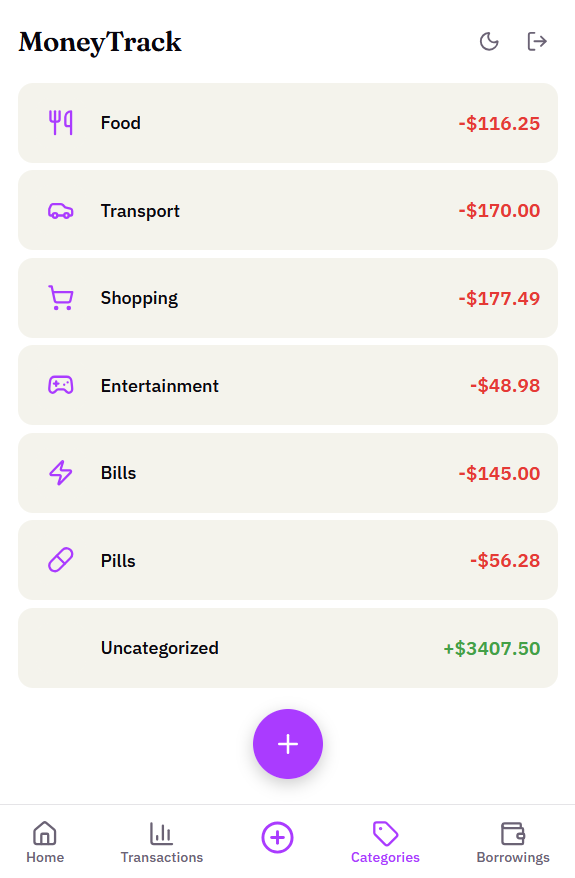
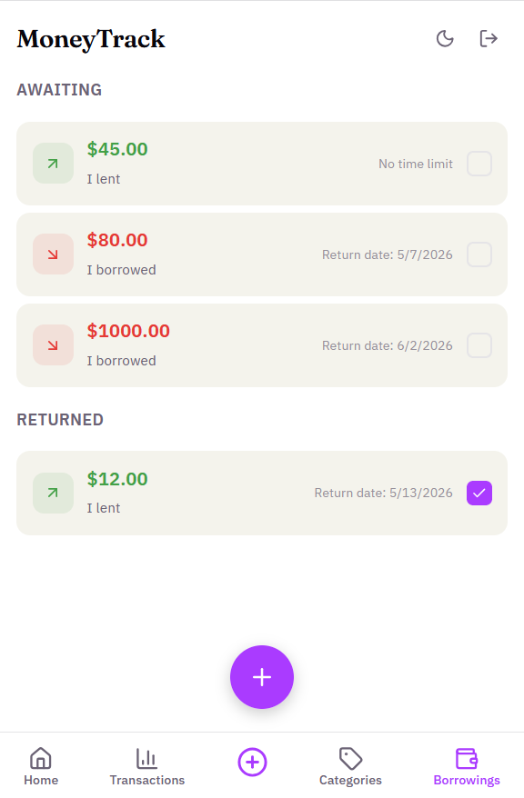

# MoneyTrack

A mobile-first money tracking web application to monitor expenses, income, and borrowings with visual analytics.

---

## Features

- **Dashboard** — overview with spending charts, recent transactions, and category breakdown
- **Transactions** — create, edit, delete, and filter transactions with pagination
- **Categories** — organize transactions by categories with custom icons
- **Borrowings** — track money lent or borrowed with status management
- **Analytics** — bar charts showing income vs expenses over time (week/month/year)
- **Auth** — register, login, and account management with JWT
- **Optimistic updates** — instant UI feedback with automatic rollback on errors

---

## Tech Stack

| Layer | Technology |
|-------|------------|
| Frontend | React, TypeScript, Vite |
| Styling | CSS (per-component) |
| Charts | Recharts |
| State | TanStack Query (React Query) |
| Routing | React Router |
| Icons | Lucide React |
| Backend | Express, TypeScript |
| Database | PostgreSQL (Drizzle ORM) |
| Auth | JWT (jsonwebtoken) |

---

## Getting Started

### Prerequisites

- Node.js 18+
- Docker and Docker Compose

### 1. Start the backend

```bash
cd backend
docker compose up --build
```

This starts PostgreSQL and the Express API on `http://localhost:3001`.

### 2. Start the frontend

```bash
cd frontend
npm install
npm run dev
```

The app opens at `http://localhost:5173`.

---

## Environment Variables

### Backend (`backend/.env`)

| Variable | Description | Default |
|----------|-------------|---------|
| `POSTGRES_DB` | PostgreSQL database name | `moneytrack` |
| `POSTGRES_USER` | PostgreSQL user | `moneytrack` |
| `POSTGRES_PASSWORD` | PostgreSQL password | `moneytrack_password` |
| `DATABASE_URL` | PostgreSQL connection string | `postgresql://moneytrack:moneytrack_password@db:5432/moneytrack` |
| `JWT_SECRET` | Secret for signing JWT tokens | *(generated)* |

### Frontend (`frontend/.env`)

| Variable | Description | Default |
|----------|-------------|---------|
| `BACKEND_URL` | Backend API URL | `http://localhost:3001` |


---

## API Endpoints

See `backend/README.md` for full API documentation.

| Method | Endpoint | Description |
|--------|----------|-------------|
| `POST` | `/api/auth/register` | Create account |
| `POST` | `/api/auth/login` | Get JWT token |
| `POST` | `/api/auth/logout` | Logout (client-side) |
| `DELETE` | `/api/auth/account` | Delete account |
| `GET` | `/api/tags` | Categories with spending summary |
| `GET` | `/api/tags/list` | All categories (no sums) |
| `POST` | `/api/tags` | Create category |
| `PATCH` | `/api/tags/:id` | Update category |
| `DELETE` | `/api/tags/:id` | Delete category |
| `GET` | `/api/transactions` | Paginated transactions |
| `POST` | `/api/transactions` | Create transaction |
| `PATCH` | `/api/transactions/:id` | Update transaction |
| `DELETE` | `/api/transactions/:id` | Delete transaction |
| `GET` | `/api/borrowing` | List borrowings |
| `POST` | `/api/borrowing` | Create borrowing |
| `PATCH` | `/api/borrowing/:id` | Update borrowing |
| `DELETE` | `/api/borrowing/:id` | Delete borrowing |
| `GET` | `/api/analytics/spending-over-time` | Chart data |
| `GET` | `/api/health` | Health check |

---

## Screenshots

<!-- To add screenshots:
1. Take a screenshot of the app (mobile viewport recommended, 390px width)
2. Save it to the screenshots/ folder at the project root
3. Uncomment the lines below
-->

### Login


### Dashboard


### Transactions


### Transaction Form


### Categories


### Borrowings


